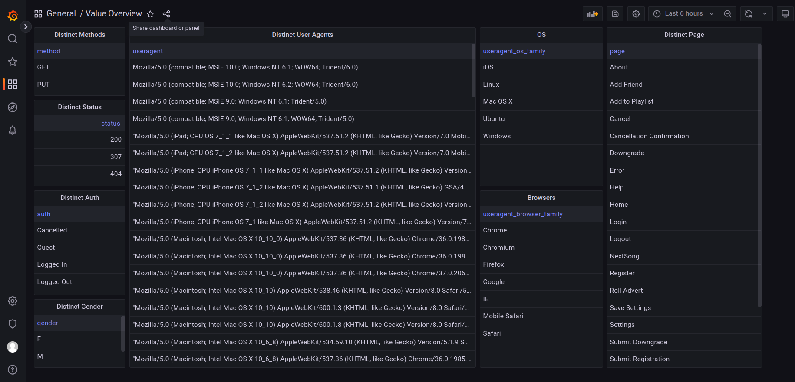

# Udacity Sparkify churn detection
This project was created in the course of the Udacity "Data Scientist" nanodegree program. This is the final (capstone) project 
that is based on a hypotetical music streaming service. This music streaming service 
wants to detect which users are most likely to cancel their subscription (churn).

There are two datasets available for this project one smaller one with about 128 MB and
a lager one with 12 GB. 

* Minimal Dataset: This dataset is included in this repository.
* Full Dataset: This can be downloaded from this URL: (https://udacity-dsnd.s3.amazonaws.com/sparkify/sparkify_event_data.json)


## Data preparation
Before we can work with this data, we want to preprocess it. In my opinion JSON files are not
well suited for this kind of operations. We will convert this dataset into ORC files, 
partitioned by timestamps. That way we can select parts of the data by time frames. 
Also spark can better filter and sort datasets. Furthermor it requires significantly 
less memory space because it is stored in a binary format. 

After converting the larger dataset to ORC the 12 GB only took 1.3 GB. For the whole processing the 
script took about 11 minutes. 

Since we are storing the ORC data in day partitions, this approach could be used in a company setup
where the API logs come in every day and are added to a bigger datalake. On this datalake the
learning algorithms can run.

The following image shows the folder structure of the output after the script has run:


## Data evaluation
For evaluating the data we will use a local Postgres database where we put the data in. And then 
we can utilize Grafana for plotting and visualizing parts of the data. We do this because Grafana
gives us the possibility to easily set up graphs, filter data with quick filters and
limit searches to certain time ranges. We could also do this with a Jupyter Notebook, but would
require manually setting up all of the plots. In a production environment this Grafana dashboards
could update automatically.

In order to run a local postgres database the following command can be used:
```commandline
sudo docker pull postgres:15.2
sudo docker run --name postgres-sparkify -e POSTGRES_PASSWORD=postgres -p 5432:5432 -v ./data/postgres:/var/lib/postgresql/data -e PGDATA=/var/lib/postgresql/data/pgdata postgres:15.2
```
We are using a default password here. For production environments this should NOT be used. But once
the container is running we can connect to the database. For example by using the open source tool 
DBeaver.

Please not that we are mounting a custom folder and specify the data path for the postgres instance. 
That way our data is persistent when we need to restart the container.

In order to spin up a Grafana Instance the following command can be used:
```commandline
sudo docker run -d --name=grafana -p 3000:3000 grafana/grafana
```

The default credentials for this image are 'admin:admin'

Once the Grafana image is running we can connect to it with a Web browser under localhost:3000.
Now we only need to add the Postgres database as datasource. When configuring a local docker
postgres we need to specify the IP Address of the computer rather than localhost. In my
example the datasource configuration looks like the following image:


### Importing Dashboards
I have added all my used dashboards as JSON files to this repository in the "dashboards" folder. 
In order to import them you need to navigate to the menue on the left of the Grafana home page. 
Here select the "Sashboards" menu entry (four squares) and select "Import". On the following
page you can use the "Upload JSON file" to upload one of the stored dashboard files.

### Observations
While looking at the data via the Grafana Dashboards a couple of thinks can be observed:


* There are only GET and PUT requests in the dataset. No POST, OPTION, PATH or DELETE requests
* We can only find HTTP statuses 200 (success), 307 (temporary redirect) and 404 (not found)
  * Why are there not 5xx (errors) responses
  * The 404 and 307 responses need to be loocked at seperately because they could be of interest for our classification.
* We can see all different browsers
* We can see different operation systems
  * But there are NO requests from ANDROID. Wheather this is caused by the dataset or if the service is not offered for android, we can not determine here
* We have a couple of distinct pages here. Most interesting right now seem to be:
  * Add Friend
  * Add to Playlist
  * Error
  * Help (perhaps a user that is downgrading has often searched for help)
  * Save Settings
  * Submit Downgrade
  * Thumbs Up
* One thing that baffels me is that there is no such page like "Search". We can only see
  a "Next Song" page. But how does users find this new songs. 

Besides the different values, we want to take a look at the distribution of different values. 
This we will do with the next dashboard.

Some interesting facts we can see from this graphs:
* Compared to the overall mount of api calls there are only very few 404 status codes
* The absolute majority of call come from Logged in users
* We have more male users in our service than female users
* Most of our users work with Windows and MacOS. So it seems that our service has hardly ever used by mobile users (this could be a problem)
* We can see more than twice as much Upgrade requests than downgrade requests. So in general this is a good trend
* We can only see 401 submit registration requests. So we do not attract very much new users.
* The majority (78%) of our users use the paid subscription. This is kind of surprising for me.

Now lets dig a little bit deeper and have a look at the http 404 errors only:

* Somehow surprising that this http error 404 only comes up when reaching out for the error page.
  Normally we would expect this to happen for example when someone searches for a song. 
* All other values seem to have roughly the same distribution

