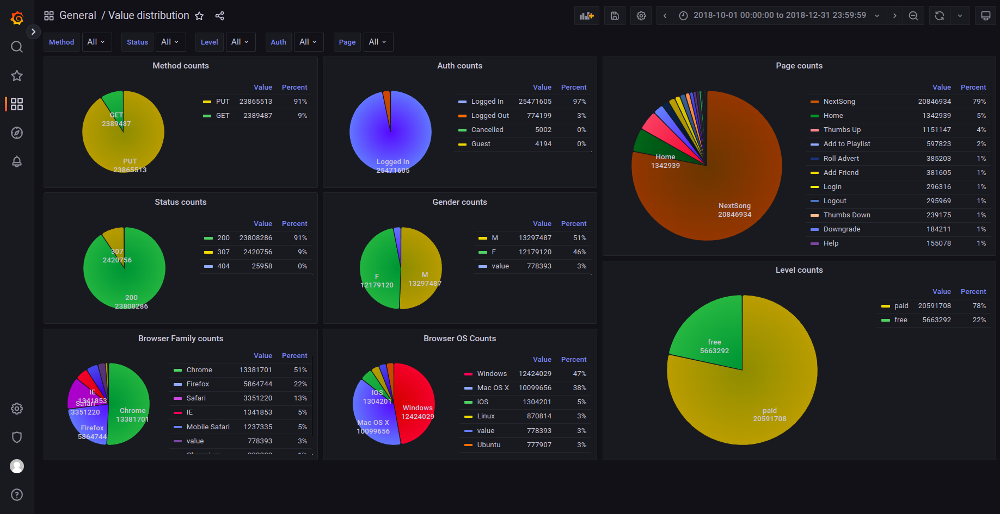

# Udacity Sparkify churn detection
This project was created in the course of the Udacity "Data Scientist" nanodegree program. 
This is the final (capstone) project, it is based on a hypothetical music streaming service (Sparkify).
To be honest the data does not look like it is artificially generated. 
But we don't want to dive into this discussion here.

This music streaming service has ha huge interest to detect which users are most likely to cancel 
their subscription or downgrade from a paid subscription to a free subscription (churn). The business
case here is very obvious. More users equals more shown adds (for free users) or more income (for paid users).

This is only a hypothetical music service, but similar questions arise at several online
services that rely on making money via subscriptions. The more users turn their back on the
service, the less money the company gets. So all companies have a hugh interest
in keeping users and more importantly keeping paid users. 

This project here does not try to answer HOW to attract new users or HOW to convince users
to stay on the platform. It will only try to answer WHICH users are most likely to leave the
platform. The other questions are more related to marketing, providing the right content
or perhaps recommending the right content. But as I have said, this is not within the scope
of this project.

There are two datasets available for this project one smaller one with about 128 MB and
a lager one with 12 GB. 

* Minimal Dataset: This dataset is included in this repository (needs to be extracted in the "data/source" folder).
* Full Dataset: This can be downloaded from this URL: (https://udacity-dsnd.s3.amazonaws.com/sparkify/sparkify_event_data.json)


## Data preparation
Before we can work with this data, we want to preprocess it. In my opinion JSON files are not
well suited for this kind of operations. We will convert this dataset into ORC files, 
partitioned by timestamps. That way we can select parts of the data by time frames. 
Also spark can better filter and sort datasets. In addition, it requires significantly 
less memory space because it is stored in a binary format. 

After converting the larger dataset to ORC the 12 GB only took 1.3 GB. For the whole processing the 
script took about 11 minutes (without parallel export to a postgres) and about 30 minutes 
(with parallel database export). 

Since we are storing the ORC data in day partitions, this approach could be used in a company setup
where the API logs come in every day and are added to a datalake. On this datalake the
learning algorithms can run (e.g. nightly).

The following image shows the folder structure of the output after the script has run:


In order to call the preparation locally wou need to invoke the following command:
```commandline
cd ./src/preprocess
python3 preprocess.py -f ../../data/source/sparkify_event_data.json
```

The following code snippet shows the possible command line arguments for the preprocessing script:
```commandline
python3 preprocess.py --help 
usage: python3 preprocess.py <arguments>

Preprocess JSON files containing SPARKIFY API logs

optional arguments:
  -h, --help            show this help message and exit
  --file FILE, -f FILE  The JSON file containing the API logs from SPARKIFY
                        (default:
                        ../../data/source/mini_sparkify_event_data.json)
  --loglevel {INFO,DEBUG,WARNING,ERROR,FATAL}, -l {INFO,DEBUG,WARNING,ERROR,FATAL}
                        Loglevel for printing console outputs (default: INFO)
  --outputfolder OUTPUTFOLDER, -o OUTPUTFOLDER
                        The target folder where to store the orc data
                        (default: ../../data/orc)
  --stripesize STRIPESIZE, -s STRIPESIZE
                        The stripe size to use for the ORC output files
                        (default: 10240)
  --database_export     Specifies if we want to also export our entries to the
                        database for visualization, exploration purposes
                        (default: True)
  --database_host DATABASE_HOST
                        The host of database where we want to store the
                        entries (default: localhost)
  --database_port DATABASE_PORT
                        The port of the database where we want to store the
                        entries (default: 5432)
  --database_name DATABASE_NAME
                        The name of the database to use where we want to store
                        our entries (default: postgres)
  --database_user DATABASE_USER
                        the username for the connection to the target database
                        (default: postgres)
  --database_password DATABASE_PASSWORD
                        the password for the connection to the target database
                        (default: postgres)
```

## Data evaluation
For evaluating the data we will use a local Postgres database where we put the data in. And then 
we can utilize the Open Source tool Grafana for plotting and visualizing parts of the data. 
We do this because Grafana gives us the possibility to easily set up graphs, filter data with quick 
filters and limit searches to certain time ranges. We could also do this with a Jupyter Notebook. But this would
require manually setting up all plots. In a production environment this Grafana dashboards
could update automatically and provide life health metrics.

In order to run a local postgres database the following command can be used:
```commandline
sudo docker pull postgres:15.2
sudo docker run \
    --name postgres-sparkify \
    -e POSTGRES_PASSWORD=postgres \
    -p 5432:5432 \
    -v ./data/postgres:/var/lib/postgresql/data \
    -e PGDATA=/var/lib/postgresql/data/pgdata postgres:15.2
```
We are using a default password here. For production environments this should NOT be used. But once
the container is running we can connect to the database. For example by using the open source tool 
DBeaver.

Please note that we are mounting a custom folder and specify the data path for the postgres instance. 
That way our data is persistent when we need to restart the container.

In order to spin up a Grafana Instance the following command can be used:
```commandline
sudo docker run -d --name=grafana -p 3000:3000 grafana/grafana
```

The default credentials for this image are 'admin:admin'

Once the Grafana image is running we can connect to it with a Web browser under localhost:3000.
Now we only need to add the Postgres database as datasource. When configuring a local docker
postgres we need to specify the IP Address of the computer rather than "localhost". In my
example the datasource configuration looks like the following image:


### Importing Dashboards
I have added all my used dashboards as JSON files to this repository in the "dashboards" folder. 
In order to import them you need to navigate to the menu on the left of the Grafana home page. 
Here select the "Dashboards" menu entry (four squares) and select "Import". On the following
page you can use the "Upload JSON file" to upload one of the stored dashboard files.

### Observations
While looking at the data via the Grafana Dashboards a couple of thinks can be observed:


* There are only GET and PUT requests in the dataset. No POST, OPTION, PATH or DELETE requests
* We can only find HTTP statuses 200 (success), 307 (temporary redirect) and 404 (not found)
  * Why are there not 5xx (errors) responses
  * The 404 and 307 responses need to be looked at separately because they could be of interest for our classification.
* We can see all different browsers
* We can see different operating systems
  * But there are NO requests from ANDROID. Weather this is caused by the dataset or if the service is not offered for android, we can not determine here
* We have a couple of distinct pages here. Most interesting right now seem to be:
  * Add Friend
  * Add to Playlist
  * Error
  * Help (perhaps a user that is downgrading has often searched for help)
  * Save Settings
  * Submit Downgrade
  * Thumbs Up
* One thing that surprised me is that there is no such page like "Search". We can only see
  a "Next Song" page. But how does users find this new songs. 

Besides the different values, we want to take a look at the distribution of different values. 
We will do this with the next dashboard.

Some interesting facts we can see from these graphs:
* Compared to the overall amount of api calls there are only very few 404 status codes
* The absolute majority of call come from "Logged in" users
* We have more male users in our service than female users
* Most of our users work with Windows and MacOS. So it seems that our service has hardly ever used by mobile users (this could be a problem)
* We can see more than twice as much Upgrade requests than downgrade requests. So in general this is a good trend
* We can only see 401 submit registration requests. So we do not attract very much new users.
* The majority (78%) of our users use the paid subscription. This is kind of surprising for me.

Now lets dig a little bit deeper and have a look at the http 404 errors only:

* Somehow surprising that this http error 404 only comes up when reaching out for the error page.
  Normally we would expect this to happen for example when someone searches for a song. 
* All other values seem to have roughly the same distribution.

When we take a look at the time distribution of our service we can also note some interesting facts:

* We can see a weekly pattern. During workdays the service is much more used than on weekends
* The number of API calls by free users is decreasing significantly over time
* The number of API calls be paid users is increasing in the first 3 weeks (nearly doubles), 
but afterwards it is also decreasing again

Since we want to evaluate the churn rate we want to take a last look at the number of downgrades
and upgrades happening over time:

Here we can see:
* The number of downgrades is mostly constant over time
* The number of upgrades is significantly decreasing

## Classification
Now that we have prepared our data in another data format and enriched it with further 
meta information we can start with our classification task.
This will be done with Apache Spark. We are performing this locally on a High Performance Laptop.
But even the full dataset can be processed like that. It just takes some time.

### Data cleaning
In this use case there luckily is not much of data cleaning to be done. The only topic
we need to take care of are log entries in the data that don't have a userid. For example
calls to the "Home" page from users that are not logged in. 

```commandline
df_data = df_data.filter(df_data['userId'].isNotNull())
```

### Feature engineering
In order to be able to classify users that are likely to churn we need to calculate features
out of the raw data. I have decided to use the following features:

#### Page Views per user
This is the total number of views for each page a user has seen. Here we assume that 
certain pages (e.g. Error or Help) indicate a tendency for users to churn. 

#### Average number of played songs per session
The assumption is that users wo play more different songs in a session like the service better
and are therefor less likely to leave it.

#### Average session duration
When a user is using the service for a longer periode of time it  might seem that he likes 
the service better and won't leave it.

#### Average Number of different artitsts per session
This feature first calculates how many songs from different artists a user consumes. And then
this number is averaged over all sessions. The suggestion is that a user who skips through
more artists is not finding what he / she is looking for.

#### Browser Usage
Here we calculate a feature for each major browser indicating if the user is using it or not. 
There might be a problem with the service with a certain browser driving people to leave 
the service.

#### Operation System Usage
This is a similar feature like the browser usage. But here we have a column for each major
operation system, indicating if the user is using it. 

### Classifiers
I have evaluated four different classifiers against the dataset. Those are:

* Decision Tree Classifier
* Random Forest Classifier
* Logistic Regression Classifier
* Linear SVC Classifier

### Metrics to evaluate the performance of classifiers
There are a couple of standard metrics that can be used to evaluate how good a classifier
is working. I DON'T want to implement a metric on our own. Instead I am using the metrics
the SPARK Machine Learning libraries are providing:
* Accuracy
* F1 Score

### Running the evaluation
I am using a local SPARK environment to evaluate my local ORC data set. So in order to 
start this you must call a spark submit with the "prediction.py" file. 
There is a shell script "submit.sh" in the "src/prediction" folder where this is shown. 
Here you can also see that I am passing a start and end time to the analysis. That way
I can control how many data is submitted to the classification. 

Since Apache Spark is a very chatty application that generates thousands of log lines, I
am mostly using grep to only filter the log lines from my code. This can be done like
this:
```commandline
submit.sh | grep PySpark
```

An example output then looks like the following listing:
```commandline
23/02/23 18:10:03 INFO PySpark: Loading ORC data
23/02/23 18:10:03 INFO PySpark: Start Date: 2018-10-01
23/02/23 18:10:03 INFO PySpark: End Date: 2018-10-10
23/02/23 18:10:06 INFO PySpark: Number of API messages in read dataset: 4073834
23/02/23 18:10:07 INFO PySpark: Number of API messages where userId is not Null: 4073834
23/02/23 18:10:08 INFO PySpark: Number of distinct user ids in data: 17175
23/02/23 18:10:08 INFO PySpark: Calculate churn
23/02/23 18:10:10 INFO PySpark: In our dataset 1717 users churned.
23/02/23 18:10:12 INFO PySpark: In our dataset 15458 users did not churn.
23/02/23 18:10:12 INFO PySpark: Calculate page views
23/02/23 18:10:13 INFO PySpark: Calculate average songs per session
23/02/23 18:10:18 INFO PySpark: Number of rows in our final feature dataframe: 17175
23/02/23 18:10:18 INFO PySpark: Split test and training data
23/02/23 18:10:18 INFO PySpark: Train Decision Tree Classifier
23/02/23 18:11:16 INFO PySpark: Test Decision Tree Classifier
23/02/23 18:11:16 INFO PySpark: Evaluate Classifier
23/02/23 18:13:09 INFO PySpark: Prediction Accuracy (Decision Tree): 0.8564761615084842
23/02/23 18:13:09 INFO PySpark: Prediction F1Score (Decision Tree): 0.1542056074766355
23/02/23 18:13:09 INFO PySpark: Confusion Matrix: Decision Tree
23/02/23 18:13:09 INFO PySpark: |2990      24        |
23/02/23 18:13:09 INFO PySpark: |338       33        |
23/02/23 18:13:09 INFO PySpark: Train Random Forest Classifier
23/02/23 18:14:44 INFO PySpark: Test Random Forest Classifier
23/02/23 18:14:44 INFO PySpark: Evaluate Classifier
23/02/23 18:16:14 INFO PySpark: Prediction Accuracy (Random Forest): 0.8559038102309581
23/02/23 18:16:14 INFO PySpark: Prediction F1 (Random Forest): 0.12626262626262627
23/02/23 18:16:14 INFO PySpark: Confusion Matrix: Random Forest
23/02/23 18:16:14 INFO PySpark: |3014      0         |
23/02/23 18:16:14 INFO PySpark: |346       25        |
23/02/23 18:16:14 INFO PySpark: Train Logistic Regresssion Classifier
23/02/23 18:17:29 INFO PySpark: Test Logistic Regression Classifier
23/02/23 18:17:29 INFO PySpark: Evaluate Classifier
23/02/23 18:19:09 INFO PySpark: Prediction Accuracy (Logistic Regression): 0.8501638355454092
23/02/23 18:19:09 INFO PySpark: Prediction F1Score (Logistic Regression): 0.09876543209876543
23/02/23 18:19:09 INFO PySpark: Confusion Matrix: Logistic Regression
23/02/23 18:19:09 INFO PySpark: |3000      14        |
23/02/23 18:19:09 INFO PySpark: |351       20        |
23/02/23 18:19:09 INFO PySpark: Train Linear SVC Classifier
23/02/23 18:20:27 INFO PySpark: Test Linear SVC Classifier
23/02/23 18:20:27 INFO PySpark: Evaluate Classifier
23/02/23 18:22:06 INFO PySpark: Prediction Accuracy (Linear SVC): 0.8387754456648623
23/02/23 18:22:06 INFO PySpark: Prediction F1Score (Linear SVC): 0.0
23/02/23 18:22:06 INFO PySpark: Confusion Matrix: Linear SVC
23/02/23 18:22:06 INFO PySpark: |3014      0         |
23/02/23 18:22:06 INFO PySpark: |371       0         |
```

For evaluation purposes there is also a Jupyter Notebook in the "jupyter" folder. This
notebook performs basically the same steps as are done in the "normal" SPARK session. 
It was helpful for debugging and evaluating the functions. But the SPARK session in Jupyter
was limited in respect to JAVA heap space, so that it had to be restarted quite regularly.

There is a html export of one run where the heap space got exhausted in the "jupyter" folder.

## Results
Running the analysis on the full dataset was challenging. But since we can limit the analysis
to certain time spans, it was possible to use small intervals for testing and debugging and
only to use the whole date range for the final test. 

All 4 tested classifiers show similar performances when running on the same dataset. 

| Classifier          | Reduced Dataset |           | Full Dataset |           |
|---------------------|-----------------|-----------|--------------|-----------|
|                     | Accuracy        | F1Score   | Accuracy     | F1Score   |
| Decision Tree       | 0.856476        | 0.154205  | 0.703591     | 0.574712  |
| Random Forest       | 0.855903        | 0.126262  | 0.678127     | 0.501915  |
| Logistic Regression | 0.850163        | 0.0987654 | 0.699793     | 0.580078  |
| Linear SVC          | 0.838775        | 0.0       | 0.694286     | 0.547263  |

It is very astonishing that the classification accuracies are far worse when trained on the
whole dataset. My first idea was that they get overfitted, but it is a quite drastically
degradation. 

My assumption is that we have some side effect in the data itself. We have seen that the
data significantly shifts over time. I suspect that this affects the classification.  

## Conclusion
With the classification approach presented here it is quite possible to perform a good
prediction of users that are likely to churn. 

For a real life usage, there would be still some topics to cover. But this project will not
cover the production ready setup or operation of the algorith on a daily basis. It was only
intended as a use case. Nevertheless here are a couple of topics that would need to be 
addressed 
* Update the dataset regularly (perhaps daily add new logs). 
* Regularly run the classification on the last x days. That way we would get a set of users
where the company should try to persuade them to stay
* Further parameter tuning of the classifiers might lead to better classification results.